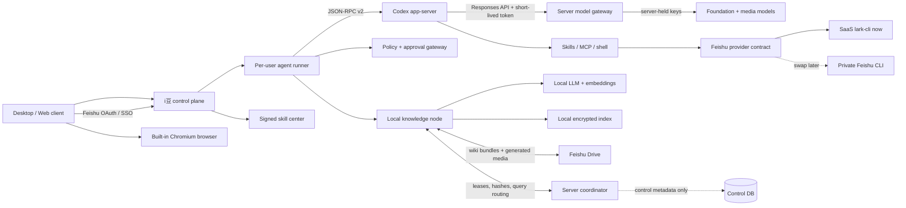

# Architecture

## Product boundary

i豆 is a thin product layer around replaceable runtimes, not a renamed Codex fork. `coding` and `cowork` are policy/instruction profiles over one session engine. Skills, MCP servers, and CLIs are capability providers discovered at runtime.



## Deployable components

### Client shell

Owns mode selection, streaming UI, source previews, recipient selection, and approval prompts. It never decides server-side authorization. The built-in browser previews Coding outputs and hosts supported Feishu document components; it exposes screenshots, console, network, DOM/accessibility, and navigation to the Agent through a narrow browser-control capability.

### Agent runner

One isolated runner is bound to one user, tenant, workspace, and device session. It supervises `codex app-server`, translates upstream events to stable product events, and applies resource/time limits. The current repository contains a local CLI version of this path.

Codex talks to a Responses-compatible model gateway on the control plane. The gateway owns foundation-model and media-provider keys. Codex obtains a short-lived bearer token through command-backed provider authentication; the helper reads the device session from the OS credential store, so neither a model key nor a long-lived Agent token is exposed to shell commands.

### Control plane

The control plane is required, but it is not an enterprise-content store. It owns Feishu login, device enrollment, short-lived Agent tokens, the model and media gateways, signed skills, policy, approvals, audit, quotas, shard leases, manifest hashes, and node routing metadata. It must reject document bodies, index bundles, images, and videos on durable storage paths. The optional [CLI bridge](feishu-cli-bridge.md) is a transient, no-store OpenAPI relay; it does not make those bytes durable control-plane data.

### Capability layer

- Skill registry: repo, user, admin, and bundled skills.
- MCP registry: approved local or private-network servers.
- CLI registry: executable providers such as Feishu.
- Policy gateway: evaluates read/write/network scope before a tool call and records the decision.

### Distributed local knowledge

Feishu documents remain the canonical source. Each enrolled client is a knowledge node. It crawls only resources its bound Feishu identity can read, normalizes and chunks locally, computes embeddings with a local model, and stores an encrypted local hybrid index (full text + vector).

Derived, content-addressed wiki bundles are synchronized to a customer-selected Feishu Drive folder. The folder is the durable distribution layer; there is no separate object store. Every node writes only below its own node prefix, so concurrent clients do not overwrite a shared file. The coordinator assigns crawl shards with expiring leases, deduplicates manifest hashes, tracks revisions and online nodes, and routes queries. It never receives document plaintext, embeddings, or bundle bytes.

```text
idou/
  tenant-<hash>/wiki/v1/
    nodes/<node-id>/manifests/<generation>.json
    nodes/<node-id>/shards/<content-hash>.bundle
    tombstones/<source-id-hash>/<revision>.json
  generated/v1/<user-id>/<yyyy-mm>/<job-id>.<ext>
```

The administrator chooses the Drive root and `maxBytes`. Before publish, the node checks Feishu quota, the configured budget, pending bytes, and a reserved free-space floor. It publishes immutable generations and garbage-collects only superseded derived bundles. Source documents are never deleted or rewritten by wiki maintenance.

Query flow:

1. The caller creates a query under a tenant and user identity.
2. The local node searches downloaded eligible shards and asks the coordinator for relevant Drive manifest references.
3. Feishu Drive permissions gate bundle download; the node also filters candidates using the caller's ACL subjects and index ACL snapshot.
4. Before returning sensitive or stale content, the source document provider revalidates current access.
5. The caller reranks locally, generates with the local LLM, and returns original Feishu document links plus revision metadata.

### Image, video, and delivery

Cowork exposes image and video generation through one asynchronous job model. The server holds provider keys and returns progress plus a short-lived result stream. The client validates and previews output, uploads accepted results to Feishu Drive, then discards the transient provider URL.

Any document, answer, image, video, or Coding preview can become a delivery draft. The user selects recipients or a chat, sending identity, link/snapshot/media form, and permission policy. Recipient names resolve to Feishu `open_id`; the app previews the exact payload and separately confirms any permission grant before sending through Feishu IM with an idempotency key.

## Knowledge identities and state

- Stable document identity: hash of tenant, provider, resource type, and provider resource ID.
- Chunk identity: hash of stable document ID, source revision, ordinal, and normalized text.
- Lease identity is separate from document identity. A late client cannot publish results after its lease generation expires.
- Deletes and permission removals are tombstones with a monotonically increasing source revision; old snapshots cannot revive them.

## Trust boundaries

- Tenant data is namespaced at storage, cache, queue, and encryption-key layers.
- Device enrollment issues short-lived node credentials; device revocation stops new leases and query routing.
- Agent login uses Feishu OAuth/SSO. The server retains the Feishu application secret and encrypted refresh material; clients retain only a device-bound session handle in the OS credential store.
- All content is encrypted at rest with customer-controlled keys where available.
- Logs contain resource IDs and hashes, not document bodies or prompts by default.
- Retrieval always carries principal, tenant, purpose, and trace IDs.
- High-risk Feishu writes require an explicit approval record and idempotency key.

## Deliberate first-version limits

- No peer-to-peer content transport is required initially. Clients exchange durable bundles through Feishu Drive and use the server only for content-free coordination metadata.
- No vector database is selected yet. The local index contract permits SQLite-based or embedded alternatives and will be decided with corpus-size benchmarks.
- No private Feishu assumptions are encoded beyond the provider v1 contract. A deployment is a definition chosen by name at the composition roots ([choosing a deployment](upstream-contracts.md#choosing-a-deployment)); business code asks it for origins, identifier rules, link shapes and capabilities.
- The local CLI proves runtime boundaries; desktop UI, persistence, and distributed indexing arrive in subsequent vertical slices.
